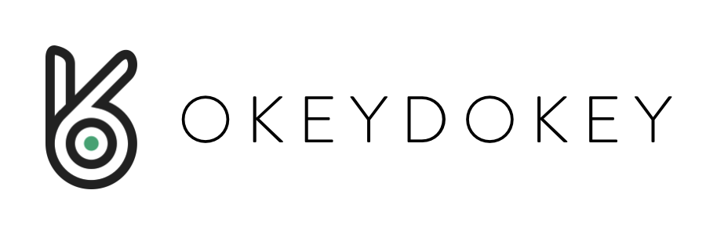

# OkeyDokey
"Opening locks via the blockchain."​

OkeyDokey is blockchain based smart door locks system that connects digital payments to opening of physical doors.

OkeyDokey’s mission is to drive productivity of rental economy by providing easily accessible and cost effective ways to utilize physical objects. In particular, OkeyDokey connects blockchain based digital payment transaction to opening of physical doors via smart locks. OkeyDokey provides value to customers by relieving the complexities and costs involved in both digital and physical operations of rental process.

<p align="center">
  
</p>

# Whitepaper
Read our [white paper](https://github.com/team-okeydokey/okeydokey/wiki/OKEYDOKEY-White-Paper).

# KEY Token Supply and Distribution
Learn more about our [Token Generation Event](https://github.com/team-okeydokey/okeydokey/wiki/OKEYDOKEY-Token-Generation-Event).


# Dependancies
Install truffle:
```bash
npm install -g truffle
```

Install ganache(Truffle's version of TestRPC):
```bash
npm install -g ganache-cli
```


# Usage
To build and deploy on local ganache test network:
```bash
chmod +x ./build.sh
./build.sh
```

If you encounter `The contract code couldn't be stored, please check your gas amount`, just run `./build.sh` again. This error occurs because we can't deploy abstract contracts.
